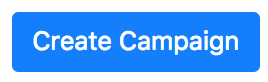
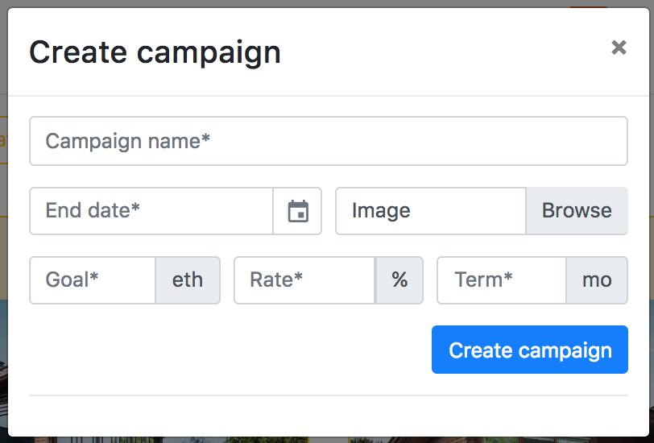
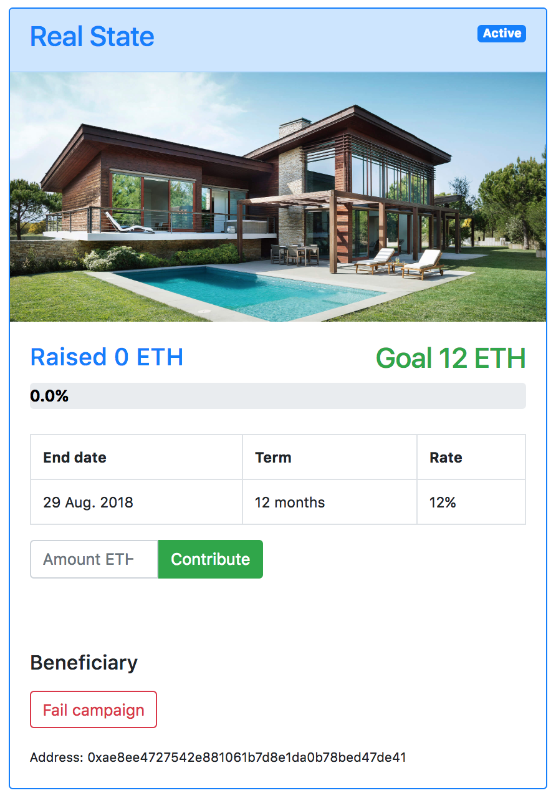
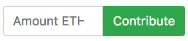
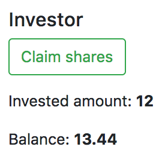

# Tutorial

<strong>NOTE: </strong> On each interaction with the dApp you will need to check Metamask to confirm the transaction. Also sometimes to see the changes reflected it will be necessary to refresh the page after the transaction has been confirmed. 

<strong>1.</strong> Click the "Create Campaign" button to create a new campaign. 
<strong>2.</strong> Fill the form with the desire data:

<ul>
  <li>Campaign name: The name of the campaign.</li>
  <li>End date: Deadline for inevsting in campaign.</li>
  <li>Image: Banner image of campaign.</li>
  <li>Goal: Goal amount for the project.</li>
  <li>Rate: Profit rate for investors.</li>
  <li>Term: Months for paying the debt.</li>
</ul>
<strong>3.</strong> Once the campaign is created a card with the information will be displayed.

<strong>4.</strong> To contribute to the campaign fill the amount and click the button.  
<strong>5.</strong> Once you have contributed to a campaign the progress bar will increment and an "Investor" section will display with the investor information. Also if you are the beneficiary a "Beneficiary" section will display. If the campaign has met the goal you can click the "Goal Reached" button to get the collected or if the goal is not met you can click "Fail Campaign" button to refund the money.

<strong>6.</strong> After the "Goal Reached" button is clicked and the money has transfered to the beneficiary the "Pay Debt" section will display and the Campaign status will change. To pay the debt fill the amount and click the button. 
<strong>7.</strong> When paying a debt the investor balance will increment and the investor will be able to claim the share. 

<strong>8.</strong> When the debt has been fully payed the campaign status will change to "Terminated".   

Additionally, if a bug presents there is a "Emergency Stop" button as a circuit breaker.
