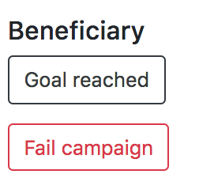

# Tutorial

<strong>NOTE: </strong> On each interaction with the dApp you will need to check Metamask to confirm the transaction. Also sometimes to visualize interface changes it will be necessary to refresh the page after the transaction has been confirmed. 

1. Click the "Create Campaign" button to create a new campaign. 
2. Fill the form with the desire data:

<ul>
  <li>Campaign name: The name of the campaign.</li>
  <li>End date: Deadline for inevsting in campaign.</li>
  <li>Image: Banner image of campaign.</li>
  <li>Goal: Goal amount for the project.</li>
  <li>Rate: Profit rate for investors.</li>
  <li>Term: Months for paying the debt.</li>
</ul>
3. Once the campaign is created a card with the information will be displayed.

4. To contribute to the campaign fill the amount and click the button.  
5. Once you have contributed to a campaign the progress bar will increment and an "Investor" section will display with the investor information.

6. If you are the beneficiary a "Beneficiary" section will display. If the campaign has met the goal you can click the "Goal Reached" button to get the collected or if the goal is not met you can click "Fail Campaign" button to refund the money.

7. 
